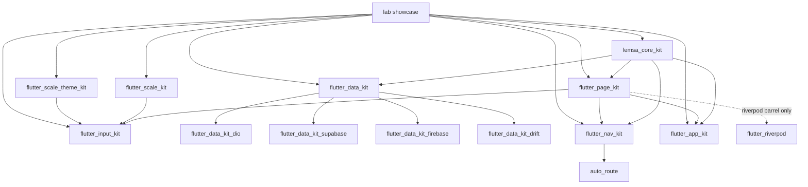

# Family map

All kits live as **sibling folders** under `lemsa_packages/` (one git repo each, except data adapters).

## Dependency graph

Solid arrows = package depends on. Dashed = optional barrel / peer.

## Ownership cheat sheet

| Package | One-line job | Must not own |
| --- | --- | --- |
| `flutter_scale_kit` | Responsive **size** (scale, breakpoints) | Colors, themes, business logic |
| `flutter_scale_theme_kit` | **Look** (tokens → ThemeData) | Layout scaling math |
| `lemsa_core_kit` | Failures, Result, disposables, extensions | Widgets, backends, Riverpod |
| `flutter_page_kit` | Page controllers, shells, busy, notices API | Riverpod in core barrel; field widgets |
| `flutter_input_kit` | Semantic fields + validators | Navigation, repositories |
| `flutter_data_kit` | Data contracts, paging, cache policy | Vendor SDKs |
| `flutter_data_kit_*` | One backend’s mapper + sources | UI, other backends |
| `flutter_nav_kit` | Routes, guards, `PageNavigator` impl | Form fields, themes |
| `flutter_app_kit` | Boot, env, secure storage, Material notices | Feature pages |
| `lab/` | Portfolio demo of the whole stack | Published package |

## Hard dependency rules

These keep the graph honest (full list in [invariants.md](../spec/invariants.md)):

1. **`flutter_page_kit` core barrel** does not depend on Riverpod. Controllers import the core barrel only.
2. **`lemsa_core_kit`** never depends on Dio, Supabase, Firebase, Drift, or Riverpod.
3. **`flutter_data_kit`** never depends on a specific backend — adapters do.
4. **Scale and theme** do not import each other or any other Lemsa kit.
5. **No kit** imports another kit’s `example/`.

## How an app picks packages

| App needs | Add |
| --- | --- |
| Responsive UI only | `flutter_scale_kit` (± theme kit) |
| Forms + pages | + `lemsa_core_kit`, `flutter_page_kit`, `flutter_input_kit` |
| REST | + `flutter_data_kit`, `flutter_data_kit_dio` |
| Supabase | + `flutter_data_kit`, `flutter_data_kit_supabase` |
| Firebase | + `flutter_data_kit`, `flutter_data_kit_firebase` |
| Local SQL | + `flutter_data_kit`, `flutter_data_kit_drift` |
| Typed routes | + `flutter_nav_kit` |
| Production boot | + `flutter_app_kit` |

Typical full app: scale + theme + core + page + input + data + one adapter + nav + app.

## Repos vs pub packages

| Layout | Packages |
| --- | --- |
| One repo = one pub package | scale, theme, core, page, input, nav, app |
| One repo = pub **workspace** | `flutter_data_kit` + `packages/flutter_data_kit_*` |
| Docs / skills / lab | `lemsa-skills` (this folder’s parent) |

Adapters share a repo because they are version-locked to the same contracts; five separate repos for one contract bump is pure coordination cost (decision D12).

## Versioning for consumers

- Flutter constraint in kits: see current floor in [package.md](../spec/package.md) (currently `>=3.44.0`, no upper bound).
- Third-party deps: `^floor` from that table.
- FVM/CI pin: only for development (currently **3.47.2**), not as a hard ceiling for apps.

## Related

- Per-package guides: [packages/README.md](packages/README.md)  
- Agent design files: [../spec/kits/README.md](../spec/kits/README.md)  
- Why: [why-this-approach.md](why-this-approach.md)
