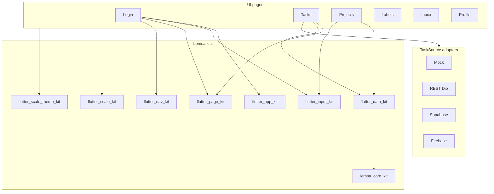

# Lab architecture (showcase)

```mermaid
flowchart TB
  subgraph ui [UI pages]
    Login
    Tasks
    Projects
    Labels
    Inbox
    Profile
  end

  subgraph kits [Lemsa kits]
    appKit[flutter_app_kit]
    navKit[flutter_nav_kit]
    pageKit[flutter_page_kit]
    inputKit[flutter_input_kit]
    dataKit[flutter_data_kit]
    coreKit[lemsa_core_kit]
    scaleKit[flutter_scale_kit]
    themeKit[flutter_scale_theme_kit]
  end

  subgraph backends [TaskSource adapters]
    mock[Mock]
    rest[REST Dio]
    sb[Supabase]
    fb[Firebase]
  end

  Login --> appKit
  Login --> inputKit
  Login --> pageKit
  Login --> navKit
  Tasks --> pageKit
  Tasks --> dataKit
  Projects --> dataKit
  Projects --> inputKit
  ui --> scaleKit
  ui --> themeKit
  dataKit --> coreKit
  Tasks --> backends
```

Selection: `LabBackend.current` → `TaskSourceFactory` → `taskRemoteSourceProvider` → `CachedTaskRepository`.
