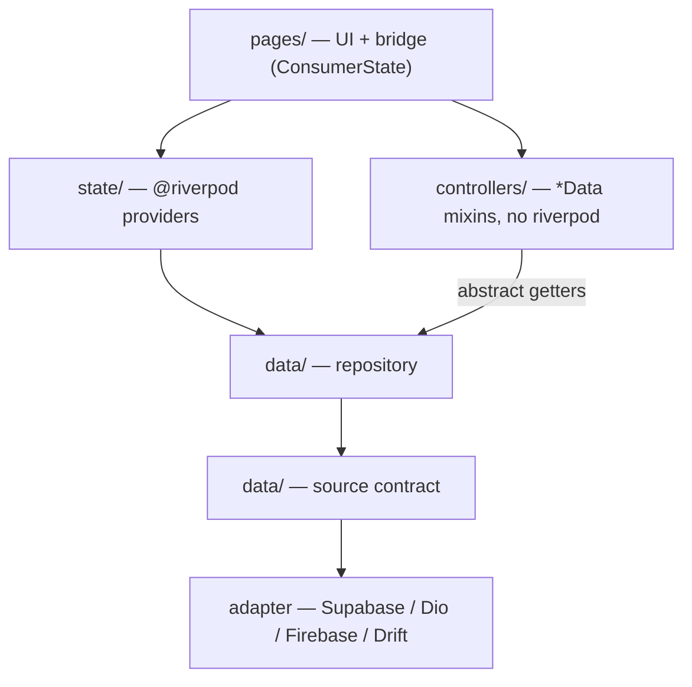

# Architecture

How a Lemsa Flutter app is laid out, and the two rules that decide everything else.

## The two dividing rules

**1. Would this state survive a page pop?** Yes → a Riverpod provider. No → the controller mixin. There is no third home.

**2. The form layer never imports Riverpod.** Controllers depend on abstract getters; the page supplies them. This is what makes a controller testable without a `ProviderScope`.

Everything below follows from those two.

## Folder layout (`architecture: feature_first`)

```text
lib/
  main.dart                      bootstrap only — see flutter_app_kit
  app.dart                       root widget: ProviderScope > ScaleKitBuilder > MaterialApp.router
  lemsa.yaml is at the project root, not in lib/

  core/
    failures/                    app-specific AppFailure subclasses, message mapping
    theme/                       STTheme definition (flutter_scale_theme_kit)
    scale/                       initScaleKit + design tokens (flutter_scale_kit)
    router/                      AppRouter, guards, deep-link table
    env/                         typed env + flavors
    widgets/                     app-wide widgets that are not fields

  features/<feature>/
    domain/                      models, drafts, queries. No I/O, no Flutter
    data/                        source contracts + adapters + repository
    state/                       every @riverpod for this feature, nothing else
    controllers/                 *_data.dart mixins. Must not import riverpod
    pages/                       *_page.dart. UI + the provider bridge
    widgets/                     feature widgets and step widgets

  i18n/                          slang input + generated output
```

`layer_first` is supported but not recommended: it scatters one feature across five top-level folders and makes deletion of a feature a five-place edit.

### Why `state/` is its own folder

One folder per feature holding only provider declarations means every provider in the app is greppable in one pass, and `build_runner` output is predictable. In the reference apps providers are spread across `providers/`, `providers/state/`, `providers/services/local/` and `data/datasources/remote/`, which is why nobody can answer "how many providers are there".

### Why `controllers/` sits beside `pages/`, not inside it

The controller must be importable by a test without importing the page. Nesting it under `pages/` invites the reverse import that exists today, where `auth_data_mixin.dart` imports `home_screen.dart` and `login_or_signup_screen.dart` — a logic file depending on two UI files.

## Naming (`naming: lemsa`)

| Thing | File | Type |
| --- | --- | --- |
| Page | `add_debt_page.dart` | `AddDebtPage` |
| Controller mixin | `debt_form_data.dart` | `DebtFormData` |
| Domain model | `debt_model.dart` | `DebtModel` |
| Write payload | `debt_draft.dart` | `DebtDraft` |
| List query | `debt_query.dart` | `DebtQuery` |
| Source contract | `debt_source.dart` | `DebtSource` |
| Source adapter | `debt_source_supabase.dart` | `SupabaseDebtSource` |
| Repository | `debt_repository.dart` | `DebtRepository` |
| Providers | `debt_providers.dart` | `debtRepositoryProvider`, `debtListProvider` |
| Feature widget | `debt_card.dart` | `DebtCard` |
| Step widget | `debt_info_step.dart` | `DebtInfoStep` |
| Field widget | (in `flutter_input_kit`) | `EmailField`, `MoneyField` |

Rules:

- Files are `snake_case`, types are `PascalCase`, no abbreviations.
- Suffix carries the role. `_page`, `_data`, `_model`, `_draft`, `_query`, `_source`, `_repository`, `_providers`.
- No `_screen` suffix in new code — a page is a route target; `_screen` in the reference apps predates the router.
- No `_widget` suffix. `DebtCard`, not `DebtCardWidget`. The type is already a widget.
- Do not propagate an existing typo into new code. `annoucement`, `testements`, `exlpore`, `providrs`, `detaille`, `ErrorHepler` and `extention` all exist in the reference apps; new files spell them correctly and the migration renames the old ones.
- One public type per file, named after the file.

## The layers, top to bottom



What each layer may import:

- `domain/` — nothing but Dart and `lemsa_core_kit`. No Flutter, no I/O.
- `data/` — `domain/`, `lemsa_core_kit`, `flutter_data_kit`. Adapters additionally import their one vendor SDK. Nothing else in the app.
- `state/` — `domain/`, `data/`, riverpod. Never `pages/` or `controllers/`.
- `controllers/` — `domain/`, `data/` contracts, `flutter_page_kit`, `flutter_input_kit`. **Never** riverpod, never `pages/`, never `state/`.
- `pages/` — everything. This is the only layer allowed to see both riverpod and a controller.

That single restriction on `controllers/` is what keeps the design honest. If a controller needs something from `state/`, the page passes it in.

## A vertical slice

Concrete shape of one feature, with the bridge visible. Details in [bridge.md](bridge.md).

```dart
// controllers/debt_form_data.dart — no riverpod, no BuildContext tricks
mixin DebtFormData<T extends StatefulWidget> on State<T>, PageData<T> {
  DebtRepository get debts;              // supplied by the page
  PageNavigator get nav;
  DebtModel? get editing;
  void onSaved(DebtModel debt);

  late final title  = text(editing?.title);
  late final amount = money(editing?.amount);

  @override
  List<Validatable> get validated => [title, amount];

  Future<void> submit() => run(key: 'save', () async { /* see errors.md */ });
}
```

```dart
// pages/add_debt_page.dart — the only riverpod code for this screen
class _AddDebtPageState extends ConsumerState<AddDebtPage>
    with Disposables, PageData<AddDebtPage>, DebtFormData<AddDebtPage> {
  @override DebtModel?     get editing => widget.debt;
  @override DebtRepository get debts   => ref.read(debtRepositoryProvider);
  @override PageNavigator  get nav     => ref.read(navigatorProvider);
  @override void onSaved(DebtModel d)  => ref.read(debtListProvider.notifier).upsert(d);

  @override
  Widget build(BuildContext context) => PageScope<DebtFormData>(
    data: this,
    child: FormPage(title: t.debt.form.title, actions: actions, child: const DebtSteps()),
  );
}
```

## What replaced what

Reading the reference apps, these are the one-to-one substitutions. The migration playbook sequences them; this table is the mapping.

| Was | Is now | Lives in |
| --- | --- | --- |
| `FormDataMixin` + `*DataMixin` | `PageData` + feature `*Data` mixin | `flutter_page_kit` |
| `FormDataProvider`, `DebtDataProvider`, `ProfileDataProvider`, `DebtCardDataProvider` | one generic `PageScope<T>` | `flutter_page_kit` |
| `checkIfFormDataValideF()` per screen | `List<Validatable> get validated` | `flutter_page_kit` |
| hand-written `dispose()` lists | `text()` / `flag()` / `items()` registry | `flutter_page_kit` |
| `ProviderScope.containerOf(GetAppContext.context!)` | abstract getters on the controller | `flutter_page_kit` |
| `catch (e) {}` | typed `AppFailure` + per-step recovery | `lemsa_core_kit` |
| `CustomButton.primary(isFormValidate:, onValideDataFormCall:)` | `PageAction` + `ActionSlot` | `flutter_page_kit` |
| `CustomTextField` (~40 params) + 15 `*InputWidget` | semantic fields over one field spec | `flutter_input_kit` |
| `ValidatorChecker` statics | composable `Validators` | `flutter_input_kit` |
| ~12 hand-written list notifiers | `PagedList` mixin | `flutter_data_kit` |
| `unified_auth_remote_source.dart` + `const useSupabase` | source contract + adapter package | `flutter_data_kit_*` |
| `MapDataModel` / `MapGetAllDataModel` wrappers | typed models at the adapter boundary | `flutter_data_kit_dio` |
| `Navigator.push(MaterialPageRoute(...))` | `PageNavigator` over auto_route | `flutter_nav_kit` |
| `GoScreen` bootstrap (~200 lines) | `Session` provider + `AuthGuard` | `flutter_nav_kit` |
| `WebRouteHelper` tab-index map | auto_route web URLs | `flutter_nav_kit` |
| `*_deep_link_screen.dart` per entity | one deep-link table | `flutter_nav_kit` |
| `GetAppContext` static grab-bag | `PageNavigator` + `Notices` + `AppContextInfo` | page kit / app kit |
| `get_it` + `injectable` + `injection.config.dart` | `@riverpod` providers | — |
| `easy_localization` flat JSON `_msg` keys | slang typed accessors | — |
| `reaxdb_dart`, `loon` | Drift | `flutter_data_kit_drift` |
| `flutter_screenutil` | `flutter_scale_kit` | — |
| `dartz` + `fpdart` together | `Result` from `lemsa_core_kit` | `lemsa_core_kit` |
| `lib/index.dart` mega-barrel | explicit imports | — |
| `password_user` in `shared_preferences` | `flutter_secure_storage`, tokens only | `flutter_app_kit` |

## Analysis options

Every app and kit starts from `very_good_analysis` with these overrides:

```yaml
include: package:very_good_analysis/analysis_options.yaml

analyzer:
  errors:
    empty_catches: error          # invariant: no silent failure
    unawaited_futures: error
  plugins:
    - custom_lint                 # riverpod_lint

linter:
  rules:
    public_member_api_docs: false # apps only; kits keep it on
```

`empty_catches` as an error is load-bearing, not cosmetic — it is the lint that enforces the error contract in [errors.md](errors.md).
