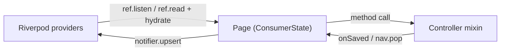

# The bridge — controller ↔ Riverpod

The controller never imports Riverpod. The **page** is the bridge, and it is the only Riverpod code for that screen.

This file answers the two questions that follow from that: how does a list update when the controller saves something, and how does the controller learn that a provider changed.

## The page as bridge

A `ConsumerState` satisfies the controller's abstract getters. That is the whole mechanism.

```dart
class _AddDebtPageState extends ConsumerState<AddDebtPage>
    with Disposables, PageData<AddDebtPage>, DebtFormData<AddDebtPage> {

  // ── inputs from the route
  @override DebtModel? get editing => widget.debt;

  // ── dependencies from providers (ref.read is legal in ConsumerState outside build)
  @override DebtRepository get debts    => ref.read(debtRepositoryProvider);
  @override MediaUploader  get media    => ref.read(mediaUploaderProvider);
  @override SyncQueue      get sync     => ref.read(syncQueueProvider);
  @override PageNavigator  get nav      => ref.read(navigatorProvider);
  @override Notices        get notices  => ref.read(noticesProvider);
  @override AppReporter    get reporter => ref.read(reporterProvider);

  // ── the write-back hook
  @override
  void onSaved(DebtModel debt) => ref.read(debtListProvider.notifier).upsert(debt);
}
```

Seven getters and one method. Because they are `ref.read` inside a getter, each call resolves at use time, so a provider that was overridden for a test resolves to the fake without the controller knowing.

`ref.read` and not `ref.watch`: a dependency is not something the page re-renders on. Watching a repository provider would rebuild the page every time an unrelated part of the graph moved.

## Controller → Riverpod: three mechanisms

Chosen per project by `list_updates` in `lemsa.yaml`. Default `callback`.

### 1. Callback (default)

The controller calls an abstract hook; the page forwards to the notifier.

```dart
// controller
void onSaved(DebtModel debt);              // declared
onSaved(saved);                            // called at the end of submit()

// page
@override
void onSaved(DebtModel d) => ref.read(debtListProvider.notifier).upsert(d);
```

No refetch, no `invalidate`, no network round trip. The list already has the authoritative object because the server returned it.

Use for: create, update, delete from a form page whose caller is the list.

### 2. Pop result

The controller returns the object through navigation; the **caller** upserts.

```dart
// controller
nav.pop(saved);

// the list page that pushed it
final saved = await nav.push<DebtModel>(AddDebtRoute(debt: debt));
if (saved != null) ref.read(debtListProvider.notifier).upsert(saved);
```

Use for: detail → list, and any case where the pushing screen is the only one that cares.

Prefer 1 over 2 when both work: 2 puts the update logic at every call site, so a second entry point to the same form silently loses the refresh.

### 3. Repository change stream

The repository emits changes; a provider fans them out. Nobody calls anybody.

```dart
// data/debt_repository.dart
Stream<Change<DebtModel>> get changes => _changes.stream;

// state/debt_providers.dart
@riverpod
Stream<Change<DebtModel>> debtChanges(Ref ref) =>
    ref.watch(debtRepositoryProvider).changes;

@riverpod
class DebtList extends _$DebtList with PagedList<DebtModel, DebtQuery> {
  @override
  DebtQuery build() {
    ref.listen(debtChangesProvider, (_, next) => next.whenData(apply));
    return const DebtQuery(pageSize: 20);
  }
}
```

Use **only** when three or more screens must react to the same change. The real case in the reference apps is kiwash's unread-message badge, where `unseen_message_counter_provider.dart` runs 535 lines coordinating Firestore snapshots against two conversation providers.

Cost: an extra indirection and a stream to keep alive. Do not reach for it because it feels more decoupled.

## `Change<T>` and `PagedList`

```dart
sealed class Change<T> { const Change(); }
final class Created<T> extends Change<T> { const Created(this.item); final T item; }
final class Updated<T> extends Change<T> { const Updated(this.item); final T item; }
final class Deleted<T> extends Change<T> { const Deleted(this.id); final String id; }
```

`PagedList` supplies the mutation surface, so a feature never writes it again:

```dart
mixin PagedList<T, Q extends PagedQuery> {
  // reads
  Future<void> loadMore();
  Future<void> refresh();
  void setQuery(Q query);          // search/filter — refetches from page 1

  // writes (local, no network)
  void upsert(T item);
  void removeById(String id);
  void patch(String id, T Function(T) update);
  void apply(Change<T> change);    // used by mechanism 3
}
```

This replaces the ~12 hand-written notifiers in kiwash (`ServiceListNotifier`, `ReservationListNotifier`, `Conversation`, `NotificationListNotifier` and the rest), each of which re-implements `reset` / `get` / `refresh` / `loadMore` with a local `_pageSize = 20`.

`setQuery` is why filtering moves server-side once a list is paginated: a client-side derived provider like lightnessword's `filteredDebtListProvider` filters only the pages already in memory, so a search on page 1 of 40 silently misses 39 pages.

## Riverpod → controller: two mechanisms

### 1. `ref.listen` calling a controller method

For reacting to a change while the page is open.

```dart
@override
Widget build(BuildContext context) {
  ref.listen(sessionProvider, (_, next) {
    if (next.valueOrNull?.isSignedOut ?? false) onSignedOut();
  });
  ref.listen(connectivityProvider, (_, next) {
    if (next.valueOrNull == Connectivity.online) onBackOnline();
  });
  return ...;
}
```

The listener subscription dies with the page, which is correct — the controller dies with it too.

### 2. `hydrate` in `initState`

For seeding fields from a provider once, at open.

```dart
@override
void initState() {
  super.initState();
  hydrate(ref.read(currentUserProvider).valueOrNull);
}
```

```dart
// controller
void hydrate(UserProfile? user) {
  if (user == null) return;
  fullName.text = user.fullName;
  phone.text = user.phone ?? '';
}
```

This replaces `ProfileDataMixin` reading `currentUserProvider` from the global container inside `initState`. Values that come from the route go through constructor args and `late final title = text(editing?.title)` instead — no hydrate needed.

## No cycles

One mechanism per direction, and neither passes through a global `BuildContext`:



The controller has no reference to the page's `ref` and no reference to a provider. It calls a method it declared and the page implemented.

## Testing the bridge

Because the controller only knows interfaces, a test supplies fakes with no `ProviderScope`:

```dart
testWidgets('validation failure paints the field and rewinds the stepper', (tester) async {
  final repo = FakeDebtRepository()
    ..onCreate = (_) => throw const ValidationFailure({'amount': 'required'});
  final saved = <DebtModel>[];

  final h = await PageHarness.mount<DebtFormData>(
    tester,
    DebtFormHost(debts: repo, onSaved: saved.add),
  );
  h.data.title.text = 'Loan';
  h.data.step.value = 2;

  await h.data.submit();

  expect(h.data.fieldErrors['amount'], 'required');
  expect(h.data.step.value, 0);
  expect(saved, isEmpty);
  expect(h.data.busy.isRunning('save'), isFalse);
});
```

To test the page's wiring instead, mount the real page inside a `ProviderScope` with overridden providers. That is a separate, thinner test — it asserts the seven getters point at the right providers, not the business logic.

## Do not

- Put `ref` on a controller, or pass `Ref` into one.
- Call `ref.invalidate(listProvider)` after a save. That refetches the whole list to learn something the server already told you.
- Watch a repository provider in a page. Read it.
- Use mechanism 3 for a two-screen case.
- Reach a notifier from the controller through a global container. That is the pattern being deleted.
