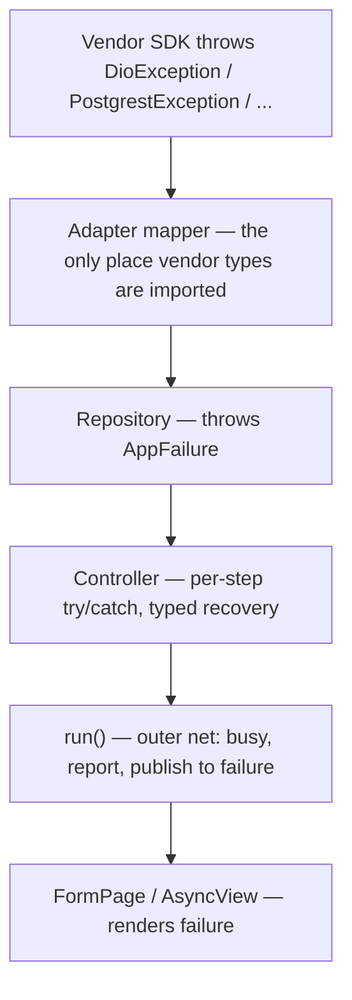

# Error contract

`try`/`catch` is **kept**. Only the *empty* catch is banned.

The mistake to avoid is the opposite over-correction: wrapping every layer in `Result<T>` and unwrapping it at every await. That is the documented readability failure of the pattern. This contract takes the useful half of both approaches.

## Two zones

**Adapter zone** — `flutter_data_kit_*` packages. One mapper per backend converts a vendor exception into a sealed `AppFailure` and throws it. This is the **only** place `DioException`, `PostgrestException`, `AuthException`, `FirebaseException` or `SqliteException` may be imported.

**Controller zone** — everything above. `AppFailure implements Exception`, so sequential steps read as plain `await` and each step keeps its own recovery with `on ValidationFailure catch`. Nested `try`/`catch` inside one action is expected, not discouraged.



## `AppFailure`

Sealed, so `switch` is exhaustive and adding a case surfaces every unhandled site at compile time. Lives in `lemsa_core_kit`.

```dart
sealed class AppFailure implements Exception {
  const AppFailure({this.cause, this.trace});
  final Object? cause;
  final StackTrace? trace;
}

final class NetworkFailure    extends AppFailure { const NetworkFailure({super.cause, super.trace}); }
final class TimeoutFailure    extends AppFailure { const TimeoutFailure({super.cause, super.trace}); }
final class CancelledFailure  extends AppFailure { const CancelledFailure(); }
final class NotFoundFailure   extends AppFailure { const NotFoundFailure(this.what, {super.cause}); final String what; }
final class AuthFailure       extends AppFailure { const AuthFailure(this.reason, {super.cause}); final AuthReason reason; }
final class PermissionFailure extends AppFailure { const PermissionFailure(this.what, {super.cause}); final String what; }
final class ValidationFailure extends AppFailure { const ValidationFailure(this.fields, {super.cause}); final Map<String, String> fields; }
final class ConflictFailure   extends AppFailure { const ConflictFailure({this.code, super.cause}); final String? code; }
final class ServerFailure     extends AppFailure { const ServerFailure({this.status, this.code, super.cause, super.trace}); final int? status; final String? code; }
final class StorageFailure    extends AppFailure { const StorageFailure({super.cause, super.trace}); }
final class UnknownFailure    extends AppFailure { const UnknownFailure({super.cause, super.trace}); }

enum AuthReason { invalidCredentials, emailNotConfirmed, expired, signedOut, disabled, rateLimited }
```

Design notes:

- `AppFailure` carries **no message string**. Messages are localized at the render site, so a failure never hardcodes English or a translation key that the i18n generator cannot see. See "Messages" below.
- `cause` and `trace` are for the reporter, never for the user.
- Apps may add subclasses in `core/failures/`. Because the base is sealed, an app-local subclass must be declared in the same library as the base — so apps extend a provided non-sealed escape hatch, `AppFailure.custom`, rather than the sealed hierarchy. Kits do not need this.

## Messages

`AppFailure` → localized string happens once, in the app, via a mapper the app owns. Kits never localize.

```dart
// core/failures/failure_text.dart
String failureText(AppFailure f) => switch (f) {
  NetworkFailure()          => t.errors.network,
  TimeoutFailure()          => t.errors.timeout,
  NotFoundFailure()         => t.errors.notFound,
  AuthFailure(:final reason) => switch (reason) {
    AuthReason.invalidCredentials => t.errors.auth.invalidCredentials,
    AuthReason.emailNotConfirmed  => t.errors.auth.emailNotConfirmed,
    _                             => t.errors.auth.generic,
  },
  ValidationFailure()       => t.errors.checkFields,
  ServerFailure(:final status) => t.errors.server(status: status ?? 0),
  CancelledFailure()        => '',
  _                         => t.errors.unknown,
};
```

Because the switch is exhaustive, adding a failure type forces the message. `CancelledFailure` maps to empty and is never shown — a user who cancelled does not need to be told.

## Adapter mappers

One per backend, and it is the package's most important file.

```dart
// flutter_data_kit_dio
class FailureInterceptor extends Interceptor {
  @override
  void onError(DioException e, ErrorInterceptorHandler h) {
    h.reject(DioException(requestOptions: e.requestOptions, error: _map(e)));
  }

  AppFailure _map(DioException e) => switch (e.type) {
    DioExceptionType.connectionError
    || DioExceptionType.connectionTimeout => NetworkFailure(cause: e),
    DioExceptionType.sendTimeout
    || DioExceptionType.receiveTimeout    => TimeoutFailure(cause: e),
    DioExceptionType.cancel               => const CancelledFailure(),
    _ => switch (e.response?.statusCode) {
      401 || 403 => AuthFailure(AuthReason.expired, cause: e),
      404        => NotFoundFailure('resource', cause: e),
      409        => ConflictFailure(code: readCode(e.response?.data), cause: e),
      422        => ValidationFailure(readFieldErrors(e.response?.data), cause: e),
      final s    => ServerFailure(status: s, code: readCode(e.response?.data), cause: e),
    },
  };
}
```

```dart
// flutter_data_kit_supabase
Future<T> mapSupabase<T>(Future<T> Function() body) async {
  try {
    return await body();
  } on PostgrestException catch (e, s) {
    throw switch (e.code) {
      '23505'    => ValidationFailure({'_': 'duplicate'}, cause: e),
      '23503'    => ConflictFailure(code: e.code, cause: e),
      '42501'    => PermissionFailure('row', cause: e),
      'PGRST116' => NotFoundFailure('row', cause: e),
      _          => ServerFailure(code: e.code, cause: e, trace: s),
    };
  } on AuthException catch (e, s) {
    throw AuthFailure(authReasonFrom(e), cause: e);
  } on StorageException catch (e, s) {
    throw StorageFailure(cause: e, trace: s);
  } on SocketException catch (e, s) {
    throw NetworkFailure(cause: e, trace: s);
  }
}
```

The interceptor form is preferred where the client supports it (Dio) because it cannot be forgotten. The wrapper form (`mapSupabase`) must be applied at every source method, so the adapter's tests assert that every public method is wrapped.

## The controller zone

`run()` is the **outer net**, not a replacement for inner handling. A failure a step already handled never reaches it.

```dart
Future<void> run(Future<void> Function() action, {Object? key}) async {
  final k = key ?? #default;
  if (busy.isRunning(k)) return;              // per-key double-tap guard
  busy.start(k);
  failure.value = null;
  try {
    await action();
  } on AppFailure catch (f, s) {              // a step chose not to handle it
    failure.value = f;
    reporter.failure(f, s);
  } catch (e, s) {                            // genuinely unexpected — never silent
    failure.value = UnknownFailure(cause: e, trace: s);
    reporter.crash(e, s);
  } finally {
    if (mounted) busy.stop(k);
  }
}
```

### Multi-step actions keep per-step recovery

This is the shape to copy. Four steps, four different recoveries, nothing silent.

```dart
Future<void> submit() => run(key: 'save', () async {
  if (!await validateForm()) return;

  // STEP 1 — optional. Failing must not lose the user's work.
  var photoUrl = editing?.photoUrl;
  if (photo.value != null) {
    try {
      photoUrl = await media.upload(photo.value!, folder: 'debts');
    } on AppFailure catch (f) {
      notices.warn(t.debt.photoSkipped);
      report(f);
    }
  }

  final draft = DebtDraft(id: editing?.id, title: title.text, amount: amount.value, photoUrl: photoUrl);

  // STEP 2 — mandatory. Recovery depends on WHY it failed.
  final DebtModel saved;
  try {
    saved = editing == null ? await debts.create(draft) : await debts.update(draft);
  } on ValidationFailure catch (f) {
    applyFieldErrors(f.fields);
    step.value = firstStepWithError(f.fields);
    return;                                   // form stays filled
  } on NetworkFailure catch (f) {
    final queued = await sync.enqueue(draft);
    queued ? notices.info(t.debt.queuedOffline) : notices.error(failureText(f));
    if (queued) nav.pop();
    return;
  } on AuthFailure {
    return;                                    // router reacts to the session change
  }

  // STEP 3 — best effort. Failing only costs freshness.
  try {
    await debts.cache(saved);
  } on AppFailure catch (f) {
    sync.markDirty(saved.id);
    report(f);
  }

  // STEP 4 — hand off.
  onSaved(saved);
  notices.success(editing == null ? t.debt.created : t.debt.updated);
  nav.pop(saved);
});
```

Note what each catch does differently: warn and continue, paint field errors and rewind the stepper, queue offline and pop, do nothing because another system handles it, mark dirty and continue. A single `catch (e) {}` — the current shape in `auth_data_mixin.dart`'s `login`, `signup`, `resetPassword` and `authenticateWithBiometrics` — collapses all five into "nothing happened", so a wrong password and a dropped connection look identical.

## `Result<T>`

For the caller that must **branch** on an expected outcome, not for plumbing.

```dart
sealed class Result<T> {
  const Result();
  static Future<Result<T>> guard<T>(Future<T> Function() body) async {
    try {
      return Ok(await body());
    } on AppFailure catch (f) {
      return Err(f);
    }
  }
}

final class Ok<T>  extends Result<T> { const Ok(this.value); final T value; }
final class Err<T> extends Result<T> { const Err(this.failure); final AppFailure failure; }

extension ResultX<T> on Result<T> {
  bool get isOk => this is Ok<T>;
  T? get valueOrNull => switch (this) { Ok(:final value) => value, Err() => null };
  AppFailure? get failureOrNull => switch (this) { Ok() => null, Err(:final failure) => failure };
  T orElse(T Function(AppFailure) recover) => switch (this) {
    Ok(:final value) => value,
    Err(:final failure) => recover(failure),
  };
}
```

Use it when the branch is the point:

```dart
final result = await Result.guard(() => auth.login(email, password));
switch (result) {
  case Ok(): break;
  case Err(failure: AuthFailure(reason: AuthReason.emailNotConfirmed)):
    return showResendConfirmation();
  case Err(:final failure):
    this.failure.value = failure;
}
```

Do **not** write a chain of `Result` unwraps across five sequential calls. Throw and catch per step instead — that is what STEP 1–4 above demonstrates.

## Reporting

`AppReporter` lives in `lemsa_core_kit` as an interface with a no-op default, so kits can report without depending on a crash SDK.

```dart
abstract interface class AppReporter {
  void failure(AppFailure f, StackTrace? trace);   // expected, handled
  void crash(Object error, StackTrace trace);      // unexpected
  void breadcrumb(String message, {Map<String, Object?> data});
}
```

Rules:

- `CancelledFailure` is not reported and not shown.
- `ValidationFailure` is reported at breadcrumb level only — it is a user event, not a defect.
- `UnknownFailure` is always a `crash`, always with the stack trace.
- The reporter never sees a raw vendor exception, because the adapter already mapped it.

## Enforcement

- `empty_catches: error` in `analysis_options.yaml`. This is the lint that makes the contract real.
- `unawaited_futures: error`, so a fire-and-forget failure cannot vanish.
- Each adapter package has a test asserting no public source method escapes without a mapper.
- `lemsa_core_kit` has a test asserting `AppFailure` has no message field, so localization cannot creep into the failure type.

## Do not

- Return `null` to signal failure.
- Catch and `print`. `print` in a catch block is an empty catch with extra steps.
- Localize inside a kit.
- Let `dartz` or `fpdart` back in. One `Result`, from `lemsa_core_kit`. Both reference apps currently depend on both libraries at once.
- Use `Either<String, T>`. A string error cannot be branched on, which is why `unified_auth_remote_source.dart` has to compare messages.
