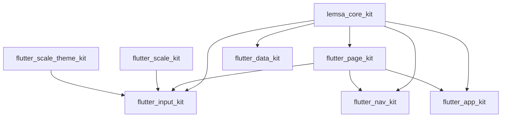

# Lemsa Skills

This repo is **documentation and Agent Skills** for the `lemsa_packages` Flutter family. No `lib/`, no `pubspec.yaml`, nothing compiles.

## What it is / is not

- **Is:** the cross-kit design brain (`spec/`), the installable skills that teach the architecture to any agent (`skills/`), and the phase prompts that let a fresh chat build one kit without this repo's history (`prompts/`).
- **Is not:** a Dart package, a starter template, a monorepo of the kits, or a place for kit implementation code.

## Layout

```
AGENTS.md                    agent instructions for editing this repo
STRATEGY.md                  pointer into spec/ + docs/
README.md                    human front page (not session memory)
docs/                        human guides: why, family map, per-package deep dives
llms.txt                     machine-readable summary
.cursor/rules/               always-on repo rules + skill authoring rules
spec/                        the durable brain (this folder)
  kits/                      one design file per package
  tasks/                     Txx build order
skills/                      installable Agent Skills
prompts/                     self-contained phase kickoff prompts
lab/                         Flutter architecture sandbox (internal, not published)
  spec/scenarios.md          S01–S12 scenario catalog
```

Human “what / why” for every package: [`../docs/`](../docs/README.md).
## The family

One git repo per package, all siblings under `C:\Users\lemsa\Documents\apps\lemsa_packages\`. Names verified free on pub.dev; `flutter_core_kit`, `flutter_base_kit`, `flutter_form_kit`, `core_kit` and `form_kit` were already taken, which is why the core package carries the `lemsa_` prefix.

| Package                        | Owns                                                               | Depends on                 | Status              |
| ------------------------------ | ------------------------------------------------------------------ | -------------------------- | ------------------- |
| `flutter_scale_kit`            | Responsive **size**                                                | Flutter only               | Published 2.0.1     |
| `flutter_scale_theme_kit`      | **Look**, theme tokens                                             | Flutter only               | Published 1.0.1     |
| `lemsa_core_kit`               | `AppFailure`, `Result`, `Disposables`, extensions, `AppLogger`     | Flutter foundation only    | In progress / local |
| `flutter_page_kit`             | Page controller mixins, shells, `PageAction`, loading, `AsyncView` | `lemsa_core_kit`           | In progress / local |
| `flutter_input_kit`            | Semantic fields, `Validators`, field schema gen                    | core, page, scale, theme   | In progress / local |
| `flutter_data_kit`             | Source contracts, `PagedList`, cache policy                        | `lemsa_core_kit`           | In progress / local |
| `flutter_data_kit_dio`         | Dio client + interceptor stack + failure mapper                    | data_kit, dio              | In progress / local |
| `flutter_data_kit_supabase`    | Supabase source + failure mapper                                   | data_kit, supabase_flutter | In progress / local |
| `flutter_data_kit_firebase`    | Firestore/Auth source + failure mapper                             | data_kit, firebase         | In progress / local |
| `flutter_data_kit_drift`       | Drift-backed local source                                          | data_kit, drift            | In progress / local |
| `flutter_nav_kit`              | `PageNavigator` over auto_route, Riverpod guards, deep-link table  | core, page, auto_route     | In progress / local |
| `flutter_app_kit`              | Bootstrap phases, typed env/flavors, secure storage, error zone    | core, page_kit             | In progress / local |
| `lemsa_lab` (this repo `lab/`) | Portfolio showcase — all kits, multi-model, swappable backends | family kits via path | Showcase (T20–T24) |



## Dependency rules

These are the load-bearing ones. Full list in [invariants.md](invariants.md).

- `flutter_page_kit` must not depend on `flutter_riverpod` / `hooks_riverpod`. The form layer is Riverpod-free by design.
- `lemsa_core_kit` must not depend on `dio`, `supabase_flutter`, `firebase_*`, `drift`, or `flutter_riverpod`.
- `flutter_data_kit` must not depend on any specific backend. Backends are adapter packages.
- Neither scale kit imports the other, and neither imports anything else in the family.
- No kit imports another kit's `example/`.

## Adapter packages and pub workspaces

`flutter_data_kit` and its adapters live in **one git repo** but publish as **separate pub packages**, wired with Dart pub workspaces (`resolution: workspace`, Dart 3.6+). A Supabase app then pulls `flutter_data_kit` + `flutter_data_kit_supabase` and never resolves Firebase.

This is the one exception to one-repo-one-package. It exists because an adapter is version-locked to the contract it implements, and splitting them into separate repos would mean coordinating five releases for one contract change.

## Generation engine

Each kit owns a `dart run <kit>:gen ...` CLI written in plain Dart, following `flutter_scale_theme_kit/bin/generate.dart` + `lib/generate_core.dart`. Mason is **not** used: `mason_cli` sits at 0.1.3 (Nov 2025), needs a separate global toolchain, and a brick cannot read the project's `pubspec.yaml` or `lemsa.yaml` to make decisions the way a package-owned CLI can.

`build_runner` is used only where the ecosystem already mandates it: `riverpod_generator`, `auto_route_generator`, `slang_build_runner`, `drift_dev`, `freezed`, `json_serializable`.

CLI core logic must stay free of Flutter and `dart:io` (put those in `bin/`), so it is unit-testable — the rule proven by `generate_core.dart`.

## Flutter + dependency policy (apps on 3.44 → newer)

**Goal:** Lemsa kits work in consumer apps on **Flutter ≥ 3.44** (through 3.47+ as those ship), without forcing one exact Flutter or one exact Drift/Riverpod/etc.

### Flutter / Dart (every kit `environment:`)

```yaml
environment:
  sdk: ^3.12.0                # Dart floor that ships with Flutter 3.44.x
  flutter: ">=3.44.0"         # lower bound only — do NOT use ^3.44 or <3.48
```

| Rule | Why |
| --- | --- |
| Floor **3.44.0** | Family baseline (Dart 3.12+); unlocks Riverpod 3.4 / Drift 2.34 / build_runner 2.16 |
| **No Flutter upper bound** in kits | Pub historically ignores Flutter uppers for packages; capping would break apps that upgrade |
| Pin **3.47.2** only in `.fvmrc` / CI | Apps may use 3.44…3.47+; kits must still resolve |

Do **not** promise “tested on every patch” — promise “constraints allow 3.44+; CI = 3.47.2”.

### Third-party packages (drift, build_runner, dio, …)

Table below = **minimum lower bounds** (APIs we use). In each kit `pubspec.yaml` write **caret**, not an exact pin:

```yaml
dependencies:
  drift: ^2.34.3          # >=2.34.3 <3.0.0
dev_dependencies:
  build_runner: ^2.16.0   # >=2.16.0 <3.0.0
```

| Do | Don’t |
| --- | --- |
| `^floor` from this table | `drift: 2.34.3` exact in published kits |
| Keep runtime deps few | Pull firebase into core |
| `pub upgrade` + `pub downgrade` + analyze/test before release | `dependency_overrides` in published kits |
| Bump floor only when you **use** a newer API | Chase “latest” every week in floors |

That way an app on Flutter 3.44 and one on 3.47 can both pick a Drift/Riverpod version in the `^` range that fits **their** whole graph.

### Inter-kit deps

Same rule: `lemsa_core_kit: ^1.0.0`. Pre-1.0 carets are narrow — prefer aligning sibling releases.

### Version floor table (checked 2026-09-12) — use as `^version`

| Package | Min (write `^min`) |
| --- | --- |
| `flutter_riverpod` / `hooks_riverpod` | 3.4.2 |
| `riverpod_annotation` | 4.0.6 |
| `riverpod_generator` | 4.0.8 |
| `riverpod_lint` | 3.1.8 |
| `auto_route` | 11.1.0 |
| `auto_route_generator` | 10.6.0 |
| `slang` / `slang_flutter` | 4.19.0 |
| `drift` | 2.34.3 |
| `drift_flutter` | 0.3.1 |
| `drift_postgres` | 1.3.1 |
| `supabase_flutter` | 2.17.2 |
| `dio` | 5.11.0 |
| `firebase_core` | 4.14.0 |
| `firebase_auth` | 6.6.1 |
| `cloud_firestore` | 6.9.0 |
| `firebase_storage` | 13.5.0 |
| `firebase_messaging` | 16.6.0 |
| `freezed` | 4.0.1 |
| `json_serializable` | 6.14.1 |
| `shared_preferences` | 2.5.5 |
| `flutter_secure_storage` | 11.0.0 |
| `build_runner` | 2.16.0 |
| `retrofit` | 4.10.0 |
| `retrofit_generator` | 10.6.0 |
| `json_annotation` | 4.9.0 |
| `copy_with_extension` / `_gen` | 17.0.0 |
| `loading_indicator` | 4.0.2 |
| `redact` | 0.1.0 |
| Flutter (FVM / CI only) | **3.47.2** |

Riverpod 3.0 has been stable since September 2025. Apps still on 2.x are migration targets, not a supported baseline.

